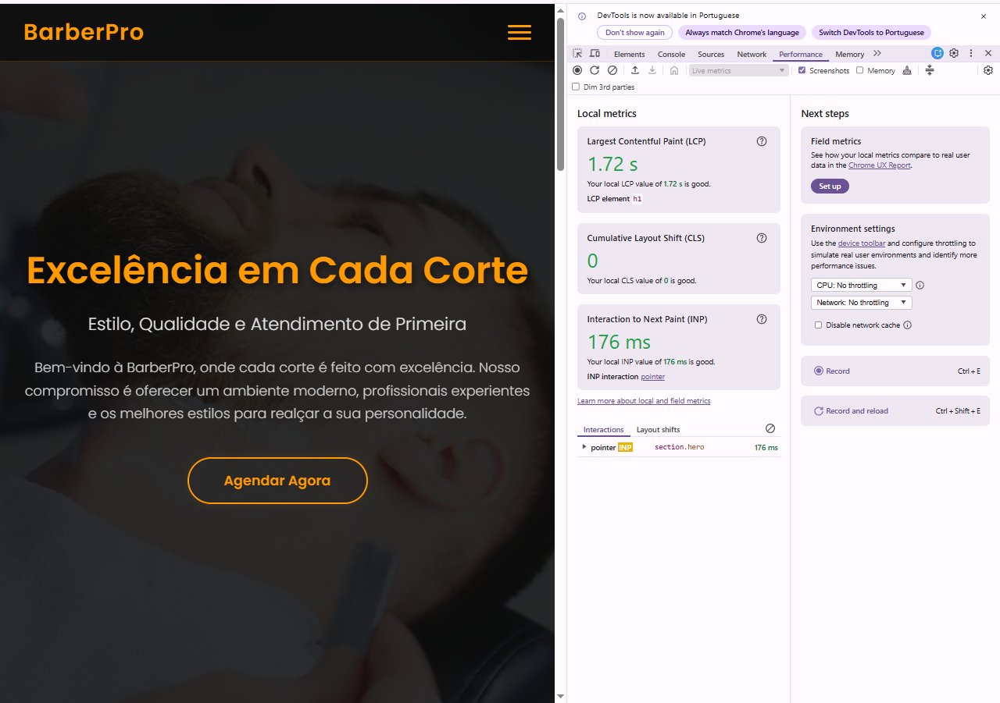

# 🪒 BarberPro — Devolutiva de Performance

**Projeto:** BarberPro Frontend  
**URL:** https://barberpro-frontend.onrender.com/  
**Módulo:** Módulo 3 — Programação em Novas Tecnologias  
**Data da análise:** 08.05.26 

---

## Sumário executivo
 
O projeto BarberPro demonstra uma implementação acima da média do módulo — autenticação JWT, áreas separadas por perfil (cliente, profissional, admin) e dados dinâmicos via API.
 
A lentidão percebida, no entanto, tem uma causa importante a destacar: **as Core Web Vitals medidas pelo DevTools estão dentro dos limites aceitáveis**, o que revela que o problema não está no frontend em si.
 
| Métrica | Valor medido | Status |
|---|---|---|
| LCP (Largest Contentful Paint) | 1.72s | ✅ Bom (< 2.5s) |
| CLS (Cumulative Layout Shift) | 0 | ✅ Perfeito |
| INP (Interaction to Next Paint) | 176ms | ✅ Bom (< 200ms) |
 
> **Conclusão:** O DevTools só começa a medir *depois* que o servidor responde. O cold start do Render acontece *antes* — por isso ele não aparece nas métricas acima, mas é a causa principal da lentidão percebida. Para confirmar: acesse o site após 20min de inatividade e observe o TTFB (Time to First Byte) na aba Network — ele vai aparecer travado por vários segundos antes de qualquer dado chegar.
---

## 🔴 Problemas Críticos

### 1. Cold start do Render (free tier)

**O que é:** No plano gratuito do Render, o servidor hiberna após aproximadamente 15 minutos sem receber requisições. O primeiro acesso "acorda" o container, o que pode levar entre 20 e 60 segundos.

**Por que acontece:** Plataformas de hospedagem gratuitas usam essa estratégia para economizar recursos de infraestrutura. Não é um bug do código — é uma limitação da plataforma.

**Solução A — Usar um monitor externo gratuito (recomendado):**

Cadastre o projeto no [UptimeRobot](https://uptimerobot.com) (gratuito) e configure um monitor HTTP a cada 10 minutos. Isso mantém o servidor "aquecido" sem custo.

```
Monitor type: HTTP(s)
URL: https://barberpro-frontend.onrender.com/
Monitoring interval: Every 10 minutes
```

**Solução B — Exibir loading state enquanto acorda:**

No `index.html`, adicione um overlay de carregamento que desaparece quando a página termina de carregar. Isso transforma a espera em feedback visual.

```html
<!-- Adicionar no body, antes de qualquer outro conteúdo -->
<div id="loading-overlay" style="
  position: fixed; inset: 0;
  background: #111;
  display: flex;
  align-items: center;
  justify-content: center;
  z-index: 9999;
  transition: opacity 0.4s;
">
  <p style="color: #fff; font-family: sans-serif;">Carregando BarberPro...</p>
</div>

<script>
  window.addEventListener('load', () => {
    const overlay = document.getElementById('loading-overlay');
    overlay.style.opacity = '0';
    setTimeout(() => overlay.remove(), 400);
  });
</script>
```

---

### 2. Vídeo MP4 no hero sem lazy loading

**O que é:** O arquivo `imagens/2319-157183741_tiny.mp4` é carregado imediatamente ao abrir a página, bloqueando o render do conteúdo principal (hero text, navbar, CTA). Isso prejudica o LCP (Largest Contentful Paint).

**Código atual (problemático):**
```html
<!-- ❌ Carrega o vídeo imediatamente, bloqueando o render -->
<video src="imagens/2319-157183741_tiny.mp4" autoplay loop muted></video>
```

**Código corrigido:**
```html
<!-- ✅ Lazy loading: carrega o vídeo só quando necessário -->
<video
  autoplay
  loop
  muted
  playsinline
  preload="none"
  loading="lazy"
  poster="imagens/hero-poster.jpg"
>
  <source src="imagens/2319-157183741_tiny.mp4" type="video/mp4">
</video>
```

**O que cada atributo faz:**

| Atributo | Função |
|---|---|
| `preload="none"` | Não baixa o vídeo até o usuário interagir |
| `loading="lazy"` | Adiante o carregamento até o elemento entrar no viewport |
| `playsinline` | Evita que o vídeo abra em tela cheia no iOS |
| `poster="..."` | Exibe uma imagem estática enquanto o vídeo não carrega — melhora muito a percepção de velocidade |

**Gerar o poster (via terminal):**
```bash
# Usando ffmpeg (gratuito)
ffmpeg -i imagens/2319-157183741_tiny.mp4 -ss 00:00:01 -frames:v 1 imagens/hero-poster.jpg
```

---

### 3. Conteúdo dinâmico sem skeleton nem tratamento de erro

**O que é:** As seções "Nossos Serviços", "Nosso Portfólio" e "Horário de Funcionamento" exibem apenas o texto "Carregando..." indefinidamente, sem limite de tempo e sem mensagem de erro caso a API falhe ou demore.

**Código atual (problemático):**
```javascript
// ❌ Sem timeout, sem erro, sem feedback
fetch('/api/servicos')
  .then(res => res.json())
  .then(data => renderServicos(data));
```

**Código corrigido com timeout e tratamento de erro:**
```javascript
// ✅ Com timeout de 5s e feedback de erro
async function carregarServicos() {
  const container = document.querySelector('#servicos');

  // Exibe skeleton enquanto carrega
  container.innerHTML = `
    <div class="skeleton" style="height: 80px; margin-bottom: 12px; border-radius: 8px; background: #e0e0e0; animation: pulse 1.5s infinite;"></div>
    <div class="skeleton" style="height: 80px; margin-bottom: 12px; border-radius: 8px; background: #e0e0e0; animation: pulse 1.5s infinite;"></div>
  `;

  try {
    const controller = new AbortController();
    const timeout = setTimeout(() => controller.abort(), 5000); // timeout de 5s

    const res = await fetch('/api/servicos', { signal: controller.signal });
    clearTimeout(timeout);

    if (!res.ok) throw new Error(`Erro HTTP: ${res.status}`);

    const data = await res.json();
    renderServicos(data);

  } catch (err) {
    container.innerHTML = `
      <p style="color: #c00; padding: 1rem;">
        Não foi possível carregar os serviços. 
        <button onclick="carregarServicos()">Tentar novamente</button>
      </p>
    `;
    console.error('Erro ao carregar serviços:', err);
  }
}
```

**CSS da animação skeleton:**
```css
@keyframes pulse {
  0%, 100% { opacity: 1; }
  50%       { opacity: 0.4; }
}
```

---

## 🟡 Melhorias Recomendadas

### 4. Links quebrados entre páginas

**O que foi encontrado:** O menu do `agendamento.html` tem dois links incorretos que quebram a navegação:

| Arquivo | Link no código | Problema |
|---|---|---|
| `agendamento.html` | `barbairo.html` | Typo — arquivo real é `barber.html` |
| `agendamento.html` | `produtos.HTML` | Extensão em maiúsculo — servidores Linux diferenciam maiúsculas de minúsculas |

**Corrigir em `agendamento.html`:**
```html
<!-- ❌ Errado -->
<a href="barbairo.html">Barbeiros</a>
<a href="produtos.HTML">Produtos</a>

<!-- ✅ Correto -->
<a href="barber.html">Barbeiros</a>
<a href="products.html">Produtos</a>
```

**Recomendação de padronização:** Adotar uma convenção única para todos os arquivos. O padrão mais seguro para deploy em Linux é tudo em minúsculas, sem espaços:

```
✅ index.html
✅ agendamento.html
✅ barber.html
✅ products.html
❌ produtos.HTML
❌ barbairo.html
```

---

### 5. Ausência de cache para assets estáticos

**O que é:** Sem configuração de cache, o navegador baixa todos os arquivos (CSS, JS, imagens, fontes) do zero a cada visita. Isso aumenta o tempo de carregamento de retorno sem necessidade.

**Solução — Criar um arquivo `render.yaml` na raiz do projeto:**
```yaml
services:
  - type: web
    name: barberpro-frontend
    env: static
    staticPublishPath: ./
    headers:
      - path: /imagens/*
        name: Cache-Control
        value: public, max-age=31536000, immutable
      - path: /css/*
        name: Cache-Control
        value: public, max-age=86400
      - path: /js/*
        name: Cache-Control
        value: public, max-age=86400
```

Isso instrui o Render a cachear imagens por 1 ano e arquivos CSS/JS por 1 dia, reduzindo significativamente o tempo de carregamento em visitas subsequentes.

---

### 6. Dados placeholder nos links de contato

**O que foi encontrado:** O WhatsApp e o Instagram do rodapé apontam para valores genéricos de desenvolvimento.

```html
<!-- ❌ Dados placeholder que chegaram até produção -->
<a href="https://wa.me/5511999999999">WhatsApp</a>
<a href="https://instagram.com/seuinstagram">Instagram</a>
```

**Solução imediata:** Substituir pelos dados reais ou, se ainda não existirem, usar uma variável de ambiente.

```html
<!-- ✅ Dados reais -->
<a href="https://wa.me/5581999999999">WhatsApp</a>
<a href="https://instagram.com/barberpro_recife">Instagram</a>
```

**Solução mais robusta (para evitar repetição):** Centralizar os dados de contato em um arquivo `config.js`:

```javascript
// config.js — editar apenas aqui quando os dados mudarem
const CONFIG = {
  whatsapp: '5581999999999',
  instagram: 'barberpro_recife',
  nome: 'BarberPro'
};

// No HTML, referenciar via JS
document.querySelectorAll('[data-whatsapp]').forEach(el => {
  el.href = `https://wa.me/${CONFIG.whatsapp}`;
});
```

---

## ✅ Pontos Positivos

O grupo demonstrou maturidade técnica significativa para o módulo. Os destaques são:

- **Autenticação JWT implementada e funcional**
- **Separação de perfis de acesso** — cliente, profissional e admin com rotas dedicadas
- **Dados dinâmicos via API** — serviços, portfólio e horários são carregados do backend
- **Deploy em produção** — o projeto está publicado e acessível publicamente

---

## Checklist de correções

Use como guia antes da entrega final:

- [ ] Configurar UptimeRobot ou upgrade do plano no Render
- [ ] Adicionar `preload="none"` e `poster` na tag `<video>` do hero
- [ ] Implementar skeleton screens nas três seções dinâmicas
- [ ] Adicionar tratamento de erro com timeout de 5s nas chamadas de API
- [ ] Corrigir os links `barbairo.html` → `barber.html` e `produtos.HTML` → `products.html`
- [ ] Adicionar `render.yaml` com configuração de cache
- [ ] Substituir dados placeholder do WhatsApp e Instagram

---

*Devolutiva gerada para fins pedagógicos — ETE Cícero Dias / Módulo 3 / 2026.1*